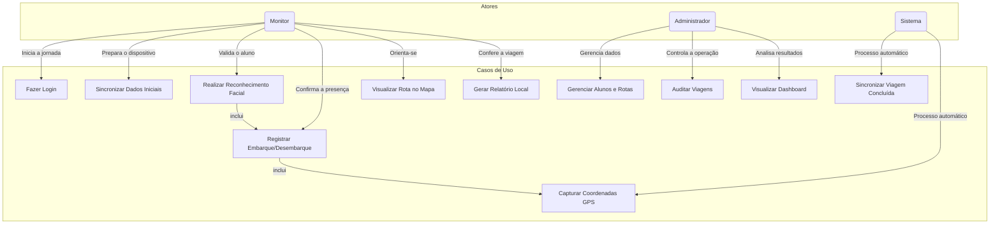
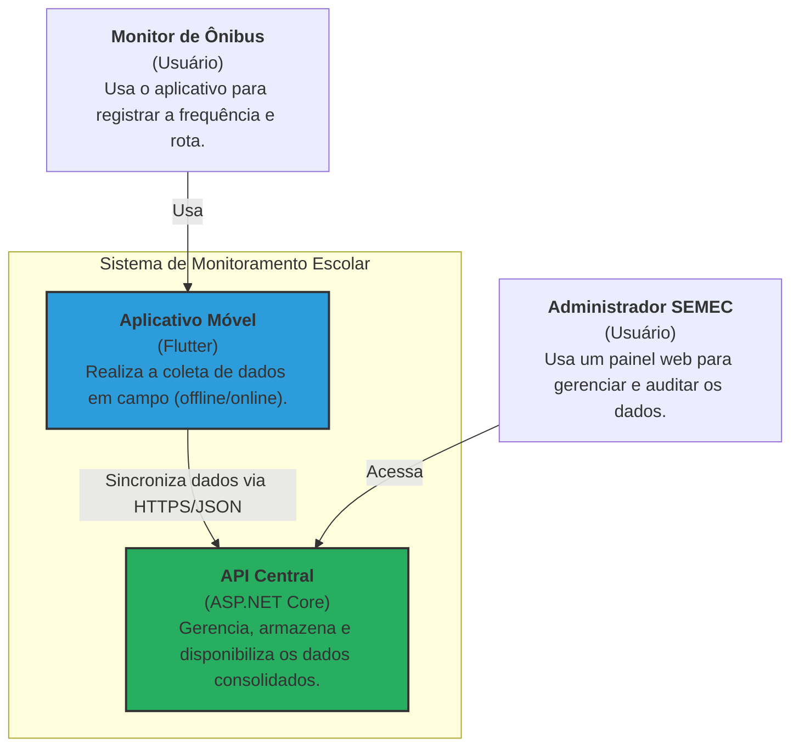
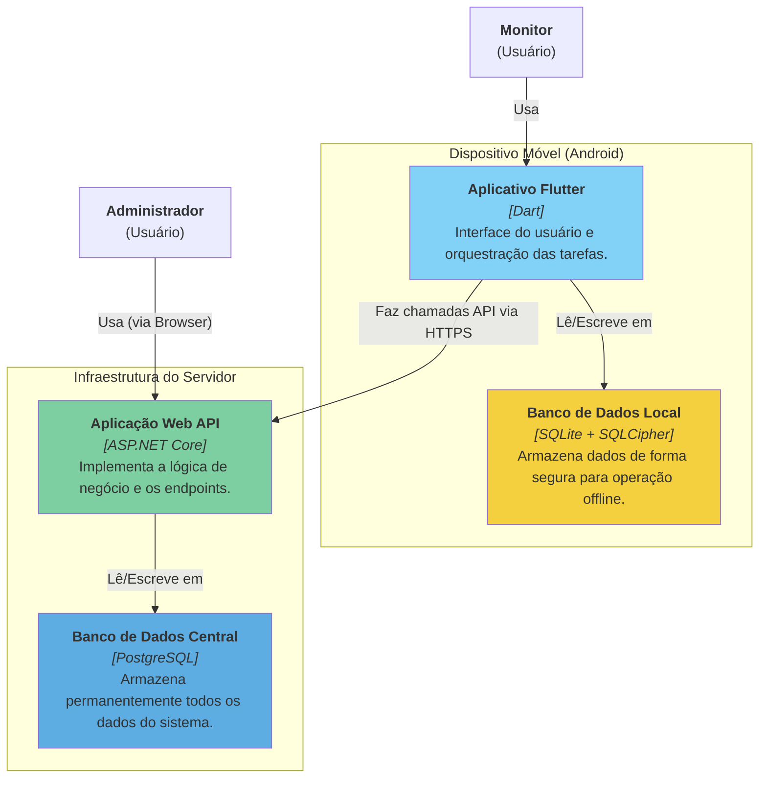
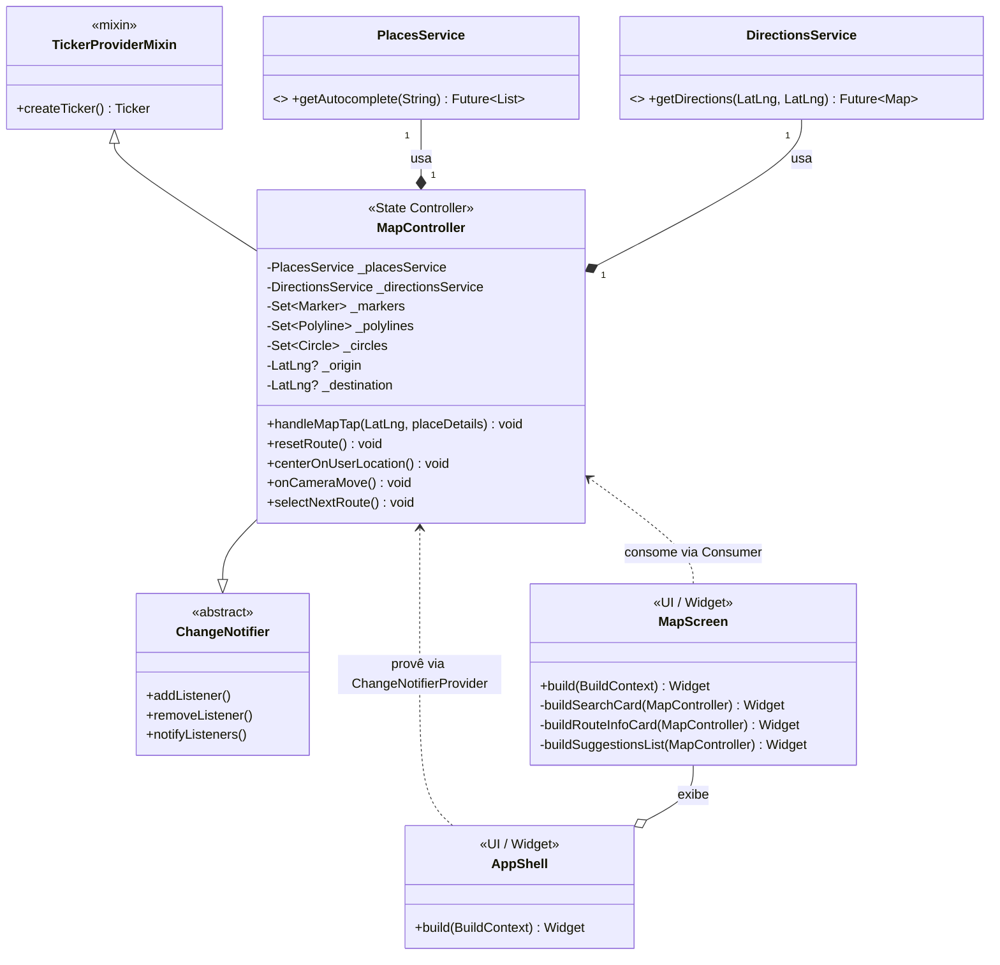
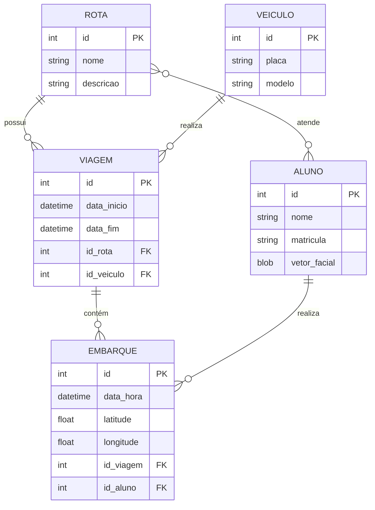
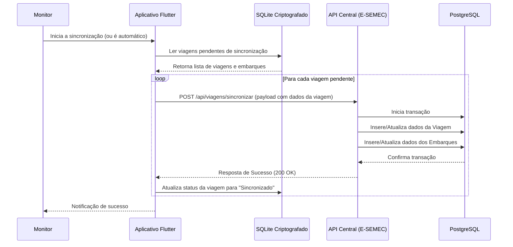
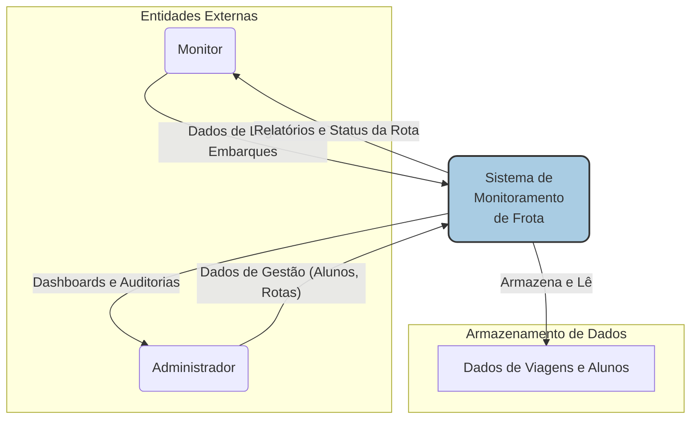

<!--
## Arquiteto de Solução e Desenvolvedor Líder

**Márcio Rodrigues de Oliveira**

* Desenvolvedor Full Stack
* cda.marcio@gmail.com
-->

# 📐 Diagramas do Projeto

Este documento centraliza todos os diagramas de arquitetura e fluxo do **Sistema de Monitoramento Inteligente da Frota Escolar**.

---

## 1. Diagrama de Casos de Uso

Este diagrama descreve as principais interações entre os atores (usuários) e o sistema.



---

## 2. Diagrama de Arquitetura da Solução (C4 - Nível 1: Contexto)

Visão macro do sistema e suas interações com sistemas externos e usuários.



---

## 3. Diagrama de Componentes (C4 - Nível 2: Contêineres)

Detalha os principais blocos de construção (contêineres) do sistema.



---

## 4. Diagrama de Classes (Aplicativo Flutter)

Este diagrama detalha as principais classes do aplicativo mobile, suas responsabilidades e relacionamentos, com foco na tela de mapa.



---

## 4. Diagrama de Entidade e Relacionamento (DER)

Modelo conceitual dos principais dados do sistema.



---

## 5. Diagrama de Sequência: Sincronização de Viagem

Descreve o fluxo de comunicação para enviar os dados coletados offline para o servidor central.



---

## 6. Diagrama de Implantação

Mostra como os componentes de software são distribuídos na infraestrutura de hardware.

```mermaid
deploymentDiagram
    node "Dispositivo Móvel (Android)" {
        artifact "app-bus.apk" {
            component [Aplicativo Flutter]
            database [Banco SQLite]
        }
    }

    node "Servidor Cloud (ex: Azure, AWS)" {
        node "Servidor de Aplicação" {
            artifact "api-semec.dll" {
                component [API ASP.NET Core]
            }
        }
        node "Servidor de Banco de Dados" {
            database [Banco PostgreSQL]
        }
    }

    [Aplicativo Flutter] -->> [API ASP.NET Core] : HTTPS/JSON
    [API ASP.NET Core] -->> [Banco PostgreSQL] : TCP/IP
```

---

## 7. Diagrama de Fluxo de Dados (DFD) - Nível 0

Ilustra o fluxo de informações entre o sistema e as entidades externas.


