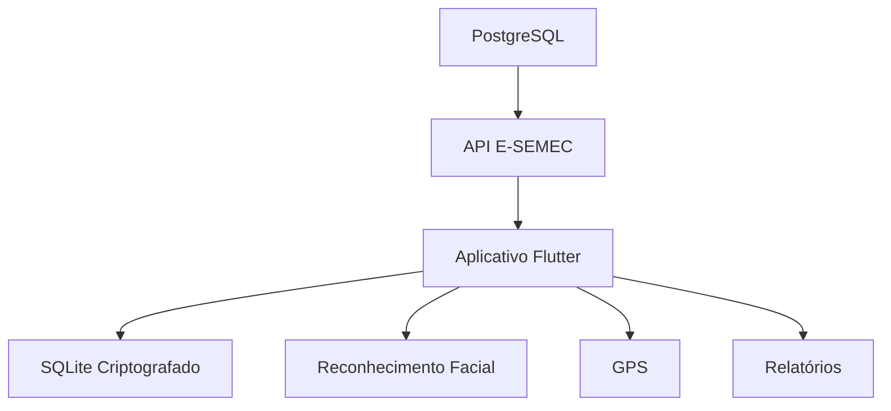
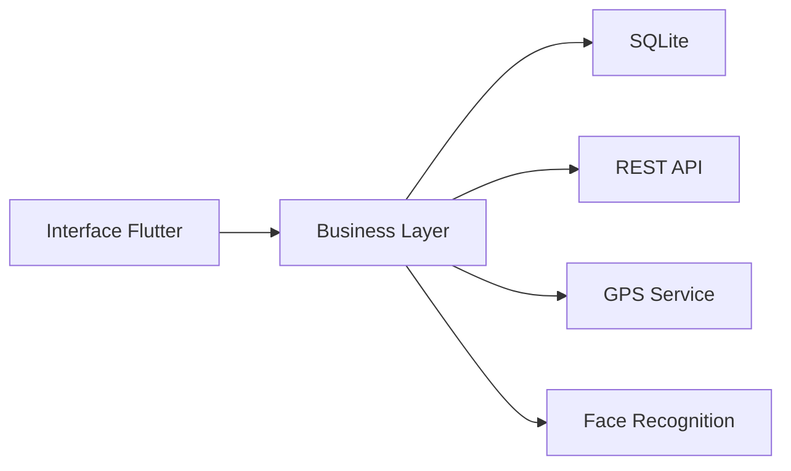
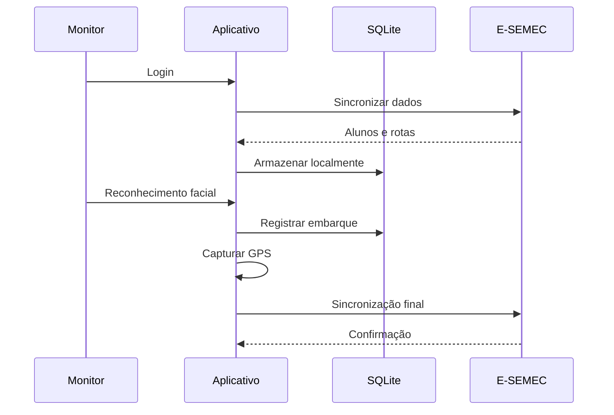

# 🚍 Sistema de Monitoramento Inteligente da Frota Escolar

<div align="center">


### Transformando o Transporte Escolar através da Inteligência Artificial, Geolocalização e Computação Offline

</div>

---

# 📖 Visão Geral

O **Sistema de Monitoramento Inteligente da Frota Escolar** foi projetado para modernizar a gestão do transporte escolar municipal da Prefeitura de Conceição do Araguaia, automatizando o controle de frequência dos alunos através de reconhecimento facial offline, monitoramento geográfico das rotas e sincronização segura dos dados com a Secretaria Municipal de Educação.

O projeto atende às necessidades operacionais das áreas urbanas e rurais do município, garantindo funcionamento contínuo mesmo em locais sem cobertura de internet.

---

# 🎯 Objetivos Estratégicos

## Educação Digital

Eliminar processos manuais de chamada escolar.

## Transparência Pública

Permitir auditoria completa das rotas executadas.

## Controle Operacional

Monitorar embarques e desembarques em tempo real.

## Conformidade Institucional

Atender exigências de:

* FNDE
* INEP
* Tribunal de Contas
* Ministério Público
* Lei Geral de Proteção de Dados (LGPD)

---

# 🚀 Principais Funcionalidades

## 👦 Reconhecimento Facial Offline

* Identificação biométrica sem internet
* Processamento local (Edge AI)
* Resposta inferior a 3 segundos
* Confirmação visual do monitor

---

## 📍 Rastreamento Inteligente

* Captura automática de GPS
* Histórico completo da rota
* Trilha auditável
* Registro georreferenciado dos embarques

---

## 📶 Operação Offline First

O sistema foi projetado para operar em ambientes rurais sem cobertura de rede.

### Funciona Offline

✅ Reconhecimento facial

✅ Registro de embarques

✅ Geolocalização

✅ Relatórios locais

✅ Armazenamento seguro

---

## 🔄 Sincronização Automática

Quando o veículo:

* Entrar na área da escola
* Conectar ao Wi-Fi autorizado
* Detectar conexão disponível

O aplicativo sincroniza automaticamente os dados.

---

# 🏗 Arquitetura da Solução



---

# 📱 Arquitetura Mobile



---

# 🛠 Stack Tecnológica

## Frontend

| Tecnologia          | Finalidade              |
| ------------------- | ----------------------- |
| Flutter             | Aplicativo Mobile       |
| Dart                | Linguagem Principal     |
| Provider / Riverpod | Gerenciamento de Estado |

---

## Backend

| Tecnologia   | Finalidade   |
| ------------ | ------------ |
| ASP.NET Core | API REST     |
| JWT          | Autenticação |
| Swagger      | Documentação |

---

## Banco de Dados

| Tecnologia | Finalidade    |
| ---------- | ------------- |
| PostgreSQL | Banco Central |
| SQLite     | Banco Local   |
| SQLCipher  | Criptografia  |

---

## Inteligência Artificial

| Tecnologia      | Uso                   |
| --------------- | --------------------- |
| Google ML Kit   | Reconhecimento Facial |
| TensorFlow Lite | IA Offline            |
| FaceNet         | Vetorização Facial    |

---

# 🔐 Segurança

## Proteção de Dados

O sistema manipula informações sensíveis de menores de idade.

### Implementações

* Criptografia AES-256
* Banco SQLCipher
* Login JWT
* Comunicação HTTPS
* Tokens de acesso temporários

---

# 📊 Fluxo Operacional



---

# 📂 Estrutura do Projeto

```bash
SEMMA-Fiscaliza/
│
├── mobile/
│   ├── lib/
│   ├── assets/
│   ├── services/
│   ├── repositories/
│   ├── models/
│   └── screens/
│
├── backend/
│   ├── Controllers/
│   ├── Services/
│   ├── Repositories/
│   ├── Models/
│   └── Database/
│
├── docs/
│
├── api/
│
└── README.md
```

---

# 📡 Endpoints

## Obter Alunos da Rota

```http
GET /api/rotas/{idVeiculo}/alunos
```

---

## Sincronizar Viagem

```http
POST /api/viagens/sincronizar
```

---

## Login

```http
POST /api/auth/login
```

---

# 🧪 Roadmap

## Versão 1.0

* [x] Especificação de Requisitos
* [x] Arquitetura Inicial
* [ ] Protótipo Mobile
* [ ] API REST

---

## Versão 2.0

* [ ] Dashboard Web
* [ ] Painel Administrativo
* [ ] BI Educacional
* [ ] Relatórios Avançados

---

## Versão 3.0

* [ ] Aplicativo dos Pais
* [ ] Notificações em Tempo Real
* [ ] Monitoramento ao Vivo
* [ ] IA para Auditoria de Rotas

---

# 📈 Benefícios Esperados

| Indicador                | Impacto |
| ------------------------ | ------- |
| Uso de Papel             | -100%   |
| Controle de Frequência   | +95%    |
| Auditoria de Rotas       | +100%   |
| Transparência            | +90%    |
| Confiabilidade dos Dados | +98%    |

---

# 👨‍💻 Equipe

## Cliente

Secretaria Municipal de Educação – SEMEC

## Supervisor

Alcides Platiny Alves Batista

## Arquiteto de Solução e Desenvolvedor Líder

**Márcio Rodrigues de Oliveira**

* Engenheiro de Software
* Desenvolvedor Full Stack
* Especialista em Sistemas Governamentais

---

# 🌐 Links

### Site

[https://mgrupo.online](https://mgrupo.online/RAZGO-Tecnologia/index.html)

---

# 📜 Licença

Software proprietário.

Desenvolvido para a Prefeitura Municipal de Conceição do Araguaia e Secretaria Municipal de Educação.

Todos os direitos reservados © 2026.

---

<div align="center">

### 🚍 Educação Inteligente • Gestão Eficiente • Transparência Pública

**SEMEC Conceição do Araguaia**

</div>
